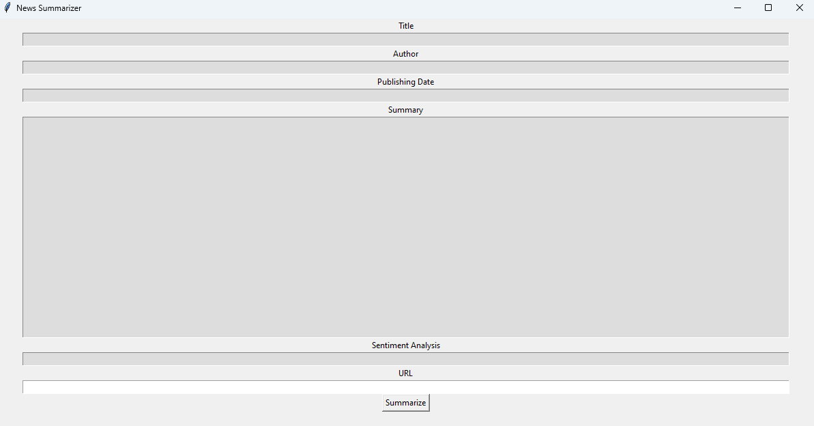
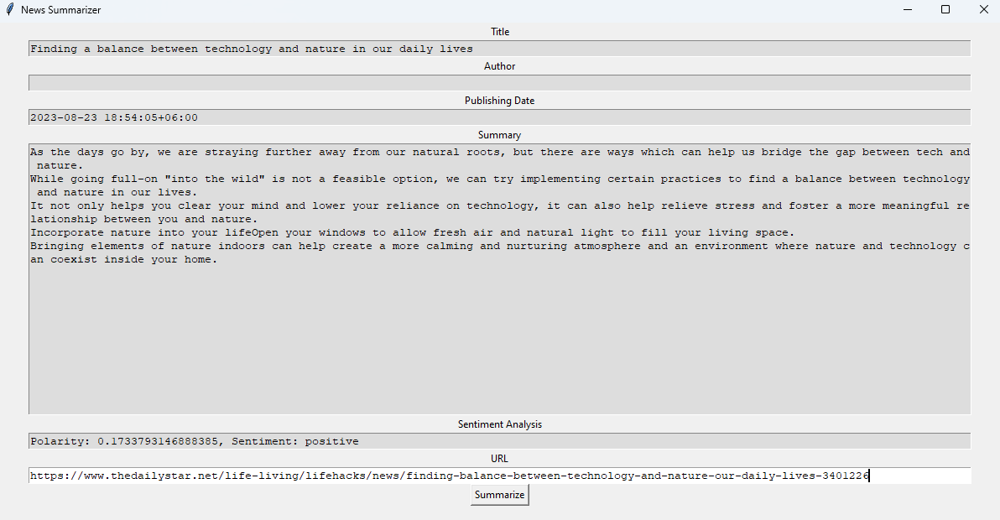

# Summarize News Articles & Sentiment Analysis
This program is a **News Summarizer Application** built using Python's **Tkinter** library for the GUI, along with the **newspaper3k**, **TextBlob**, and **NLTK** libraries for text processing and analysis. 

---

First we need to install `pip` in  current environment, for these:

---

### **Step 1: Check if `pip` is already installed**

Run the following command in  terminal:

```bash
pip --version

```

If `pip` is installed, it will show the version number. If not, proceed to install it.

---

### **Step 2: Install `pip`**

### Option 1: Using Python's built-in method

1. Download `get-pip.py`:
Run:
    
    ```bash
    curl https://bootstrap.pypa.io/get-pip.py -o get-pip.py
    
    ```
    
2. Run the script to install `pip`:
    
    ```bash
    python get-pip.py
    
    ```
    

### Option 2: Using  package manager (Windows or Linux)

- **For Windows**:
Ensure Python is added to PATH. Then run:
    
    ```bash
    python -m ensurepip --upgrade
    
    ```
    
- **For Linux/Mac**:
    
    ```bash
    sudo apt update
    sudo apt install python3-pip
    
    ```
    

---

### **Step 3: Verify Installation**

Check if `pip` is successfully installed:

```bash
pip --version

```

---

### **Step 4: Upgrade `pip` (Optional)**

Make sure you're using the latest version:

```bash
pip install --upgrade pip

```

**For the project, we should install the following Python packages and libraries:**

### Installed Libraries:

1. **`newspaper3k`**
    - Purpose: Used for extracting and parsing news articles.
    - Features:
        - Article extraction
        - Natural Language Processing (NLP) like summarization and keyword extraction.
    - Installation Command:
        
        ```bash
        pip install newspaper3k
        ```
        
2. **`nltk` (Natural Language Toolkit)**
    - Purpose: A library for text processing and NLP tasks.
    - Features:
        - Tokenization
        - Stopword removal
        - Stemming and lemmatization.
    - Installation Command:
        
        ```bash
        pip install nltk 
        ```
        
3. **`textblob`**
    - Purpose: Simplifies NLP tasks like sentiment analysis and text classification.
    - Features:
        - Text processing (like noun phrase extraction).
        - Sentiment analysis.
    - Installation Command:
        
        ```bash
        pip install textblob
        ```
        
4. **`lxml`**
    - Purpose: Used by `newspaper3k` for fast and efficient parsing of HTML/XML documents.
    - Features:
        - Extracts and cleans web data.
    - Installation Command:
        
        ```bash
        pip install lxml
        ```
        

---

### Additional Notes:

- If you encounter missing dependencies, make sure to install them. For instance:
    - **Missing `lxml.html.clean`:**
        - Command:
            
            ```bash
            pip install lxml-html-clean
            ```
            
    - **Missing `punkt` tokenizer for `nltk`:**
        - You already addressed this in your code:
            
            ```python
            nltk.download('punkt')
            ```
            

Once `pip` is installed, now we can install the necessary libraries and proceed with coding.

---

### 1. Import Libraries in Code

```python
import tkinter as tk  # For GUI (if needed)
import nltk  # For natural language processing
from textblob import TextBlob  # For text analysis
from newspaper import Article  # To fetch and process articles
```

- **Tkinter**: A standard GUI library in Python used to create the user interface.
- **NLTK**: **(Natural Language Toolkit)** is a powerful and widely used library in Python designed for working with human language data, also known as **Natural Language Processing (NLP)**. It provides tools and resources to process, analyze, and understand text data, making it a valuable tool in **Artificial Intelligence (AI)** and NLP-related tasks.
- **TextBlob**: Used for sentiment analysis of the article text.
- **newspaper3k (Article)**: A library for web scraping and article processing (e.g., downloading, parsing, and summarizing).

---

### 2. **Summarize Function**

The `summarize()` function performs the main tasks:

1. **URL Input**:
    
    ```python
    url = utext.get('1.0', "end").strip()
    ```
    
    is used to extract the **text input** from a **Tkinter `Text` widget**, specifically the text entered by the user, and process it. Here's what each part of this line does:
    
    ---
    
    ### 1. **`utext.get('1.0', "end")`**
    
    - **`utext`**: The `Text` widget where the user inputs the data (e.g., the URL in this case).
    - **`get('1.0', "end")`**:
        - **`'1.0'`**: Indicates the starting point of the text retrieval.
            - **`1`**: Refers to the first line of the text box.
            - **`.0`**: Refers to the 0th character of that line (the very beginning).
        - **`"end"`**: Indicates the end of the text, retrieving everything until the last character (including a newline added automatically by Tkinter).
    
    In short, `utext.get('1.0', "end")` retrieves all the text entered in the `utext` widget.
    
    ---
    
    ### 2. **`.strip()`**
    
    - The **`.strip()`** method is applied to the retrieved text to:
        - **Remove leading and trailing whitespace**.
        - **Remove the extra newline** added by Tkinter at the end of the text.
    
    This ensures that the final `url` variable contains only the user's input without any unwanted spaces or newlines.
    
2. **Article Processing**:
    
    ```python
    article = Article(url)
    article.download()
    article.parse()
    article.nlp()
    ```
    
    1. **`article = Article(url)`**
        - Creates an `Article` object.
        - The **`url`** is passed as an argument, and it specifies the webpage or news article to process.
        - This object will hold all the data (text, title, author, publish date, etc.) from the article once processed.
    2. **`article.download()`**
        - Downloads the content of the article from the given URL.
        - Fetches the webpage’s HTML source code.
        - Ensures the content is retrieved successfully for further parsing.
    3. **`article.parse()`**
        - Parses the downloaded HTML content.
        - Extracts important parts of the webpage, like:
            - The article’s main text.
            - Title, authors, and other metadata.
        - Cleans up unnecessary elements like advertisements or navigation links.
    4. **`article.nlp()`**
        - Performs **Natural Language Processing (NLP)** on the parsed article.
        - Key operations include:
            - Extracting **keywords** that summarize the content.
            - Generating a **summary** of the article by identifying its most important sentences.
3. **Display Results**:
    
    ```python
    title.config(state='normal')
    title.delete('1.0','end')
    title.insert('1.0',article.title)
    ```
    
    - Updates the `title` widget with the article's title. Similar operations are done for:
        - **Authors**: Fetched using `article.authors`.
        - **Publish Date**: Fetched using `article.publish_date`.
        - **Summary**: Fetched using `article.summary`.
4. **Sentiment Analysis**:
    
    ```python
    analysis = TextBlob(article.text)
    sentiment.insert('1.0', f'Polarity: {analysis.polarity}, Sentiment: {"positive" if analysis.polarity > 0 else "negative" if analysis.polarity < 0 else "neutral"}')
    
    ```
    
    - Performs sentiment analysis on the full article text using TextBlob.
    - Displays polarity (numerical value) and sentiment (positive, negative, or neutral).
5. **Re-disable Widgets**:
    
    ```python
    title.config(state='disabled')
    ```
    
    - Disables text widgets after updating, ensuring they are read-only.

---

### 3. **GUI Layout**

The GUI is created using Tkinter, and various widgets are arranged in a structured format:

1. **Main Window**:
    
    ```python
    root = tk.Tk()
    root.title("News Summarizer")
    root.geometry('1200x600')
    
    ```
    
    - Creates the main application window with a title and dimensions.
2. **Title Section**:
    
    ```python
    tlabel = tk.Label(root, text="Title")
    tlabel.pack()
    title = tk.Text(root, height=1, width=140)
    title.config(state='disabled', bg='#dddddd')
    title.pack()
    
    ```
    
    - Displays a label ("Title") and a disabled `Text` widget for showing the article title.
3. **Author Section**:
    - Similar to the Title section, a `Label` and a `Text` widget display the article's author(s).
4. **Publication Date Section**:
    - Displays the publishing date.
5. **Summary Section**:
    - A larger `Text` widget shows the article's summary.
6. **Sentiment Section**:
    - Displays the sentiment analysis result.
7. **URL Input**:
    
    ```python
    ulabel = tk.Label(root, text="URL")
    ulabel.pack()
    utext = tk.Text(root, height=1, width=140)
    utext.pack()
    
    ```
    
    - Allows the user to input the article's URL.
8. **Summarize Button**:
    
    ```python
    btn = tk.Button(root, text="Summarize", command=summarize)
    btn.pack()
    
    ```
    
    - A button that triggers the `summarize()` function when clicked.

---

### 4. **Program Execution**

The `root.mainloop()` call starts the Tkinter event loop, making the application interactive and responsive to user input.

---

### **How It Works**

1. The user enters a URL in the input field.
2. On clicking the "Summarize" button:
    - The article is fetched from the URL and processed (title, author, summary, etc.).
    - Sentiment analysis is performed on the article text.
    - Results are displayed in their respective sections.
3. The application ensures a user-friendly interface with a clean layout and disabled output fields for readability.

---

### **Dependencies**

- **newspaper3k**: For article scraping and summarizing (`pip install newspaper3k`).
- **TextBlob**: For sentiment analysis (`pip install textblob`).
- **Tkinter**: Pre-installed with Python.

### The GUI Interface:


### Output:
